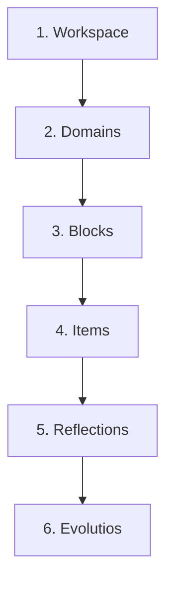

# 🌌 Hermes OS

> *"How do I deliberately become the person I want to become?"*

Most modern applications are built to hijack your attention. They optimize for endless scrolling, fake productivity, and arbitrary streaks. Hermes is an attempt to build a completely different kind of software.

Hermes is a premium, distraction-free **Personal Development Operating System** designed to capture your intellectual and emotional evolution over decades.

[](https://opensource.org/licenses/MIT)
[](https://flutter.dev)
[](#)

---

## 🏛️ The Mythos: Why "Hermes"?

In Greek mythology, **Hermes** is the messenger, the god of writing, language, and transitions. He is the *psychopomp*—the guide who walks between worlds and crosses thresholds. 

We named this system **Hermes** because it serves the same purpose in your life:
*   **The Guide of Transitions:** Hermes documents your *Evolutios* (moments of intentional change) as you cross the threshold from who you are today to who you want to become.
*   **The Messenger of Knowledge:** He brings external ideas (articles, questions, philosophy) cleanly into your local, offline environment.
*   **The Protector of Lores:** Just as the mythological Hermes crossed boundaries between realms, the OS helps you navigate and isolate different "lores" (startup lore, college lore, personal philosophy) without clutter.

---

## ⚡ What Can Hermes Actually Do?

* **Distraction-Free Article Reader:** Paste any web URL. Hermes strips all ads, cookie banners, and navbars, converts the HTML to clean Markdown via `html2md`, and renders it in a beautiful OLED-black reader.
* **Hierarchical Knowledge Organization:** Isolate different areas of your life (e.g., *Startup Lore*, *Computer Science*) into dedicated Workspaces, Domains, and Blocks.
* **FOSS Workspace Portability:** Package your entire learning track (database and assets) into a `.hermes` zip file. Share it with anyone, anywhere.
* **Safe Archiving Engine:** Accidentally delete a workspace? The self-healing "Felix" fallback automatically catches and recovers orphaned items.
* **Veritas (Truth) Logs:** No guilt trips for missing a day. Log the real reasons you couldn't practice (exams, burnout) to maintain an honest timeline of your life.

---

## ⚖️ Why Hermes?

**Today's apps optimize:**
❌ Completion
❌ Retention
❌ Streaks

**Hermes optimizes:**
✅ Understanding
✅ Reflection
✅ Intentional Growth

---

## 🎨 Design Principles

* **Offline First**
* **Privacy by Default**
* **Intentional Growth**
* **No Gamification**
* **User Owns Their Data**

---

## 🏛️ Architecture (High Level)

Hermes organizes your life into a strict, self-healing cascade:



*For a deep dive into the self-healing storage engine, Felix fallbacks, and the Markdown parsing pipeline, see [docs/Architecture.md](docs/Architecture.md).*

---

## 👁️ The Hermes Codex

At its core, Hermes replaces the concept of "tasks" with the concept of **Evolutios**. 

In 2035, you won't care that you solved 5,000 math problems. You will care about the moments that transformed how you think. Hermes preserves **change**. Every meaningful shift in your understanding becomes an **Evolutio**.

**The Central Equation:**
`Experience ➔ Reflection ➔ Insight ➔ Evolutio ➔ Evolution`

---

## 🚧 Current Status

Hermes is currently under active development.

**Current Phase:**
✔ Codex v1.0 Complete
✔ Flutter Implementation (Genesis Release)
🚧 Linux Desktop Port
⬜ Community Packages
⬜ AI Companion

---

## 🚀 Installation

### Prerequisites
* Flutter 3.44+
* Java 17

### Building the Application
```bash
# Run on Linux Desktop
flutter run -d linux

# Build Android Release APK
flutter build apk --release
```

### Obtainium (Android Updates)
To keep Hermes updated directly on your Android phone without using Google Play:
1. Open **Obtainium** on your phone.
2. Tap **Add App** and paste: `https://github.com/Harshajaya13/Hermes`

---

## 🗺️ Roadmap
* **v1.0.0 (Genesis):** Core offline-first engine, Article Fetcher, and Android build. (Completed)
* **v2.0.0 (Evolution):** UI/UX polishing, Micro-animations, and full Linux Desktop optimization.
* **v3.0.0 (Expansion):** Community `.hermes` package sharing hub.

---

## 🤝 Contributing

Hermes is an attempt to build software that respects the person using it.

If this philosophy resonates with you, you're welcome to build it with us.
