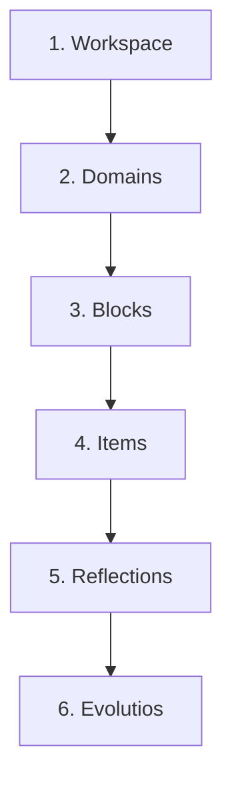

# 🌌 Hermes OS

> *"How do I deliberately become the person I want to become?"*

Hermes is a premium, distraction-free **Personal Development Operating System** built to answer that single question. 

It is not a task manager. It is not a habit tracker. It is not a gamified productivity app. Hermes exists to catalog your intellectual and emotional growth over decades. Built strictly around the **Hermes Codex** philosophy, it operates completely offline, with zero subscription gates, zero notifications, and absolute data portability.

---

[](https://opensource.org/licenses/MIT)
[](https://flutter.dev)
[](#)

---

## 👁️ The Codex Philosophy

Most applications ask: *"Did you complete your task?"*
Hermes asks: *"Did you become even slightly different today?"*

Hermes operates on a strict set of core laws defined in the original Codex specifications. 

### 1. What Hermes Refuses to Become
We don't want to be a to-do list with streaks, XP, coins, or leaderboards. We are not an infinite-scrolling feed or a dopamine hitter. Not all people can maintain streaks—not because of a lack of discipline, but because life happens. Breaking a streak makes you feel guilt for your own work. Hermes refuses to punish absence.
**No streaks. No XP. No coins. No leaderboards. No notifications begging users. No endless feeds. No infinite scrolling. No advertisements.**

### 2. Intentionality
Nothing enters Hermes by accident. Everything inside Hermes exists because the user deliberately chose it to become part of their journey. You don't want random scrolling or random learning. Everything is chosen. Everything has intention.

### 3. Veritas (Truth)
Most productivity apps punish absence. Hermes understands reality. 
If you missed a day because you reached home at 10 PM completely exhausted, or because of semester exams, or burnout—you log it in **Veritas**. 
Hermes never says *"You failed."* It says *"Tell the truth."* Years later, your timeline becomes honest, not fake perfection. Writing the truth decreases the pressure of missing a streak, because you cannot fool yourself.

### 4. Evolutio: The Core Metric of Growth
In 2035, you won't care that you solved 5,000 math problems. You will care about moments like: *"This article completely changed how I see product design."*
Those are not tasks. They are transformations. 
Hermes preserves **change**. Every meaningful change becomes an **Evolutio**.

**The Central Equation of Hermes:**
```text
Experience 
  ↓ 
Reflection 
  ↓ 
Insight 
  ↓ 
Evolutio 
  ↓ 
Σ(Evolutios) = Evolution
```
Not every reflection changes you. But every Evolutio represents a genuine shift.

---

## 🏛️ Information Architecture

Hermes organizes your life into a strict, self-healing hierarchical cascade:



1.  **Workspace:** The top-level container to isolate entirely different "lores" of your life (e.g., *Startup Lore*, *College Lore*, *Stoicism*).
2.  **Domain:** Represents one intentional area of long-term growth (e.g., *Computer Science*, *Physical Health*).
3.  **Block:** Dedicated interactive environments containing specific subsets of knowledge or action.
4.  **Item:** Individual points of focus. Can be **Questions** to trigger reflection, or **Articles** to read.
5.  **Reflection:** Your active thoughts, observations, or answers associated with an Item.
6.  **Evolutio:** Self-driven evidence of meaningful cognitive shifts or milestones.

---

## ⚡ Key Features

### 1. Self-Healing Archive Engine ("Felix" Fallbacks)
Like a true Unix filesystem, deleting a parent object (like a Domain or Block) does not permanently destroy its child elements; it safely moves them to the **Archive**. 
If you restore an orphaned Item or Block whose parent has been permanently deleted, the storage engine self-heals by redirecting them into the **Felix Domain** and **Felix Block** fallback zones, preventing data loss or database crashes.

### 2. Distraction-Free Article Fetcher & Reader
Hermes features a built-in clean scraping pipeline. Paste any web URL (such as a Medium post, blog, or Wikipedia article), and Hermes:
*   Strips away all ads, tracking scripts, cookie prompts, and navigation menus.
*   Extracts the raw article HTML and uses `html2md` to convert it into structured Markdown.
*   Renders it locally in a beautiful, customizable OLED black reader using native Markdown styling.

### 3. FOSS Community Ecosystem (`.hermes` File Format)
Your entire workspace is packaged as a proprietary `.hermes` file. 
*   **Under the hood:** A `.hermes` file is a ZIP container containing a manifest (`metadata.json`), your raw SQLite/JSON database (`database.json`), and local attachments/images.
*   **Export/Import:** Easily package a learning track (e.g., `Stoicism.hermes`) and share it. Anyone can import it directly into their Hermes instance.

---

## 🛠️ Technical Stack

*   **Framework:** [Flutter](https://flutter.dev) (Linux Desktop & Android Mobile)
*   **State Management:** [Riverpod](https://riverpod.dev)
*   **Storage Engine:** Offline-first JSON Local Storage Engine
*   **HTML Parsing & Markdown:** [html2md](https://pub.dev/packages/html2md) & [flutter_markdown](https://pub.dev/packages/flutter_markdown)
*   **Archive Engine:** [archive](https://pub.dev/packages/archive) zip utility

---

## 🚀 Getting Started

### Prerequisites

You need **Flutter** and **Java 17** installed on your system.

```bash
# Verify your installations
java -version
flutter doctor
```

### Manual Android SDK Setup (Linux/Ubuntu)

If you prefer a clean Linux environment without Snaps or the heavy Android Studio IDE:

1.  **Download Command Line Tools:**
    ```bash
    wget https://dl.google.com/android/repository/commandlinetools-linux-14742923_latest.zip -O ~/cmdline-tools.zip
    ```
2.  **Extract to the Sdk Directory:**
    ```bash
    mkdir -p ~/Android/Sdk/cmdline-tools
    unzip ~/cmdline-tools.zip -d ~/cmdline-tools-extracted
    mv ~/cmdline-tools-extracted/cmdline-tools ~/Android/Sdk/cmdline-tools/latest
    rm -rf ~/cmdline-tools.zip ~/cmdline-tools-extracted
    ```
3.  **Install SDK Components:**
    Using the local `sdkmanager`, download the required platform and compiler tools (Flutter 3.44+ targets Android SDK 36):
    ```bash
    ~/Android/Sdk/cmdline-tools/latest/bin/sdkmanager "platform-tools" "platforms;android-36" "build-tools;28.0.3"
    ```
4.  **Link and Accept Licenses:**
    ```bash
    flutter config --android-sdk ~/Android/Sdk
    yes | flutter doctor --android-licenses
    ```

---

## 📦 Building the Application

### Run on Linux Desktop
```bash
flutter run -d linux
```

### Build Android Release APK
```bash
flutter build apk --release
```
The compiled APK will be generated at:
📁 `build/app/outputs/flutter-apk/app-release.apk`

---

## 📱 Installation via Obtainium

To keep Hermes updated directly on your Android phone without using Google Play Store:
1. Open **Obtainium** on your phone.
2. Click **Add App**.
3. Paste the link to your GitHub repository:
   `https://github.com/Harshajaya13/Hermes`
4. Tap **Add**. Obtainium will automatically pull your latest uploaded release APK!

---

## 📄 License

This project is licensed under the MIT License - see the [LICENSE](LICENSE) file for details.
