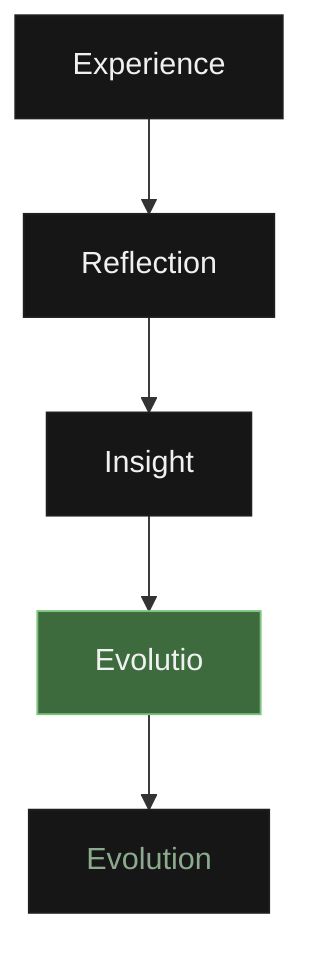

  

# Hermes: A Founding Document

Every day we consume information. 

Very little of it changes who we become.

Hermes exists to answer a single question:

What happens to the knowledge we consume?

Modern software is built around consumption and completion. 

We are given countless tools to track habits, complete tasks, read articles, and optimize our workflow. 

We measure success by the number of boxes ticked, the length of the streak, and the sheer volume of data processed. 

But completion is not understanding. 

Checking off a task does not mean cognitive growth has occurred. 

Storing a bookmark does not mean the information has been understood. 

> Hermes does not measure activity.
> 
> Hermes measures changed thinking.

Hermes began because I wanted a system that I personally wanted to use every day. 

I was not trying to build another productivity application. 

I was building the environment that I wished already existed—a quiet, local, and fiercely intentional space designed solely to help you transform information into understanding, and understanding into evolution. 

It is built to preserve the moments where your mind fundamentally changes.

This document is written for myself five years from now, for future teammates, for future contributors, and for anyone who wants to understand why Hermes was built. 

It preserves the philosophy of the operating system, because while features will evolve, the philosophy should not.

## The Hermes Laws

Hermes refuses to become another engagement platform.

Therefore:

❌ No streaks

❌ No XP

❌ No coins

❌ No leaderboards

❌ No notifications asking you to return

❌ No infinite scrolling

❌ No advertisements

Hermes should never compete for your attention.

It should quietly wait until you choose to return.

## Why the Name "Hermes"?

The name is not chosen out of an obsession with mythology. 

Hermes is not an idol to be worshipped; it is a meticulously chosen metaphor. 

In ancient tradition, Hermes was the messenger—the entity capable of traversing different realms, crossing borders that others could not. 

In this system, Hermes represents the movement of knowledge. 

Ideas travel. 

Information crosses boundaries. 

Understanding requires a bridge between what you knew yesterday and what you realize today. 

The application exists to serve as that bridge, helping you move raw knowledge across the threshold of mere consumption into genuine, internalized understanding. 

## Intentionality

Intentionality is the bedrock of Hermes. 

Modern technology has trained us to passively receive information. 

We doom-scroll, we let algorithms suggest our next video, and we allow apps to automatically sync massive lists of unread content. 

Hermes demands the opposite. 

Nothing enters Hermes accidentally. 

Every single piece of knowledge must be manually and deliberately chosen by the user. 

Why? Because manually choosing knowledge creates stronger psychological ownership. 

When you actively decide to bring a question, an article, or an idea into your workspace, you are making a conscious commitment to engage with it. 

You are moving from a passive consumer to an active curator of your own mind.

## The Interface as a Philosophy

I spent days designing the interface, not just the backend. Why?

Because the interface *is* the philosophy.

Why **Today's Pursuit**? Because progress happens through focused attention, not overwhelming choice. Presenting a user with 100 tasks creates anxiety and decision fatigue. Presenting them with a few intentional items creates focus and calm.

Why **Pinned Domains**? Because human beings repeatedly return to the same core areas of knowledge. Reducing friction is critical; if accessing your most important knowledge takes too many clicks, you will stop doing it.

Why is the **Typography Calm** and the **Whitespace Generous**? Because reading should feel like a sanctuary. 

Why **OLED Black**? Because bright colors alarm the nervous system. OLED black recedes into the background. The ultimate goal of the Hermes design language is for the interface to completely disappear, leaving nothing between you and the knowledge you are consuming.

Why are **Cards Lightweight**? Because they contain heavy thoughts. The container should never distract from the content.

## The Structure of Knowledge

Knowledge in Hermes naturally flows downward through a strict hierarchy. 

Flat folders fail because they lack context and inevitably devolve into chaotic digital junk drawers. 

Hermes enforces structure to preserve meaning:

Workspace 

↓ 

Domain 

↓ 

Block 

↓ 

Item 

↓ 

Reflection 

↓ 

Evolutio

Why **Workspaces**? Because context switching is expensive. When you are studying pure mathematics, you should not be looking at your grocery list or your startup ideas. Workspaces create hermetically sealed environments for different identities. 

Why **Domains**? Because life does not fit into temporary folders. Domains categorize long-term pillars—Engineering, Philosophy, Health. They are lifelong territories of mastery.

Why **Blocks**? Because specific knowledge requires a focused environment. Python, Deep Learning, Product Design—these are Blocks. They group related knowledge into solid foundations.

## The Cognitive Equation

The entire architecture of Hermes exists to facilitate and protect a specific cognitive sequence:

Experience is what happens to you—the article you read, the mathematical problem you solved, the idea you had. 

Reflection is the deliberate act of pausing to examine that experience. 

Insight is the sudden clarity derived from that examination. 

An Evolutio is the recorded, permanent proof of that insight. 

Evolution is the compounding result of those moments accumulated over time. 

If software only captures the "Experience" (the task, the bookmark), it fails. 

Hermes refuses to stop there. It gently pushes the user all the way down the equation.

## Veritas

Veritas is the Latin word for truth. 

In Hermes, Veritas is the mechanism for recording reality when life interrupts your pursuits.

Why does Veritas exist? Because traditional habit trackers lie. 

If you study for 100 days, miss one day because you are sick, and the tracker resets your streak to zero, the software is lying about your progress. 

It uses guilt to drive engagement. 

Guilt-driven productivity eventually fails because it punishes the user for living a normal human life. 

Veritas exists to replace guilt with objective truth. 

When you miss a day in Hermes, you do not lose points. 

You simply record a Veritas—a short, honest explanation of why you paused. 

Perhaps you were exhausted. Perhaps you were prioritizing your family. Perhaps you simply needed rest. 

Recording reality is infinitely healthier than pretending you possess machine-like consistency. 

Even if a user never writes another Evolutio, Veritas exists to ensure that truth itself is preserved. 

## Evolutio

An Evolutio is a documented cognitive shift. 

It is the atomic unit of growth in Hermes.

Why is the word intentionally singular? Because an Evolutio is a distinct, standalone realization. 

Why does not every reflection become an Evolutio? Because genuine understanding cannot be forced. 

You can read ten articles and write ten reflections, but you might only experience one true cognitive shift. 

Cognitive shifts are rare, and Hermes treats them with the reverence they deserve. 

Hermes measures your progress by counting your Evolutios, rather than your completed tasks, because changed thinking is the only metric that actually matters in personal development. 

## The Anatomy of an Item

Knowledge in Hermes is heavily categorized to enforce intent.

Why do **Questions** exist as a primary item type? Because solving a question creates understanding. Holding a question in your mind creates a void that your brain actively seeks to fill.

Why does Hermes include a custom **Reader Engine**? Because reading should feel intentional. Reading on the modern web is a hostile experience filled with advertisements, pop-ups, and notifications. Hermes renders articles locally to strip away distractions. It treats Markdown and LaTeX as first-class citizens. Reading an article inside Hermes should always feel profoundly better than reading it on its original website.

Why does Hermes strictly use **Markdown** for Notes? Because proprietary formats eventually die. Software companies go bankrupt. File formats become unsupported. Plain text lasts forever. By forcing notes into standard Markdown, Hermes ensures that your knowledge will remain readable and accessible decades from now.

## The Knowledge Pipeline

Hermes strictly regulates how knowledge enters the system via Manual Import, RSS, and curated Community Sources.

Why are there no automatic AI recommendations? Because an AI suggesting what you should learn next violates the law of intentionality. The user must actively pull knowledge into their system. Hermes provides the pipes, but the user must turn the valve.

## Search and Archive

Why does **Search** operate primarily on ideas and content rather than just filenames and folders? Because human memory is associative. You rarely remember exactly which folder you placed a concept in, but you always remember the core idea. 

Why does Hermes **Archive** items instead of immediately deleting them? Because knowledge is rarely useless; it is usually just out of context. Hermes employs a self-healing archive philosophy through Felix. When you dismiss an item, you are telling the system you do not need it right now. Felix ensures that if you ever need that knowledge again, it can be recovered exactly as it was.

## Offline First & .hermes Bundles

Hermes does not just "work offline." Offline is its default state. 

Why? Because of ownership and longevity. 

Personal knowledge is the most intimate data a human being can possess. 

It should never depend on a company's servers remaining online. 

It should never be held hostage by a subscription fee. 

By utilizing local SQLite databases and plain Markdown, Hermes ensures that you physically own your thinking. 

Because you own your thinking, knowledge must be transferable without lock-in. 

Hermes introduced the **.hermes** bundle—a compressed, standardized package of your knowledge. 

You can export a single mathematical Block, share it with a colleague, and they can intentionally import it into their own workspace. 

It guarantees long-term preservation because the format is entirely open.

## Long-Term Vision & Open Source

This project is intended to evolve over many years. 

The architecture values longevity over modern development trends. 

Technology will change, but the philosophy should remain understandable and intact. 

Hermes is open source because ideas must be free to evolve. 

We are not claiming that this is the *only* correct philosophy for learning. 

This is simply the philosophy that built Hermes. 

If you say a system is the only correct way, you build a cage. 

If you share a philosophy and invite others to build upon it, you build a sanctuary.

Contributions are welcome, and improvements are encouraged. 

If someone forks Hermes and creates something better, that is not a failure. 

It means the ideas continued to evolve. 

The philosophy matters far more than ownership of the market. 

If this way of thinking resonates with you, build with us.

## The Architect

Hermes began as a deeply personal pursuit to build the exact environment I needed to cultivate my own understanding. 

It is dedicated to my community and the teams that will form around it. 

I invite you to discuss these ideas, contribute to the codebase, or forge your own path with this philosophy. 

You can find me and follow the journey here: [github.com/Harshajaya13](https://github.com/Harshajaya13)

## 

We cannot promise that Hermes will make you more productive.

We hope it helps you become more thoughtful.

If, years from now, you open Hermes and discover a version of yourself you had forgotten, then it has fulfilled its purpose.
