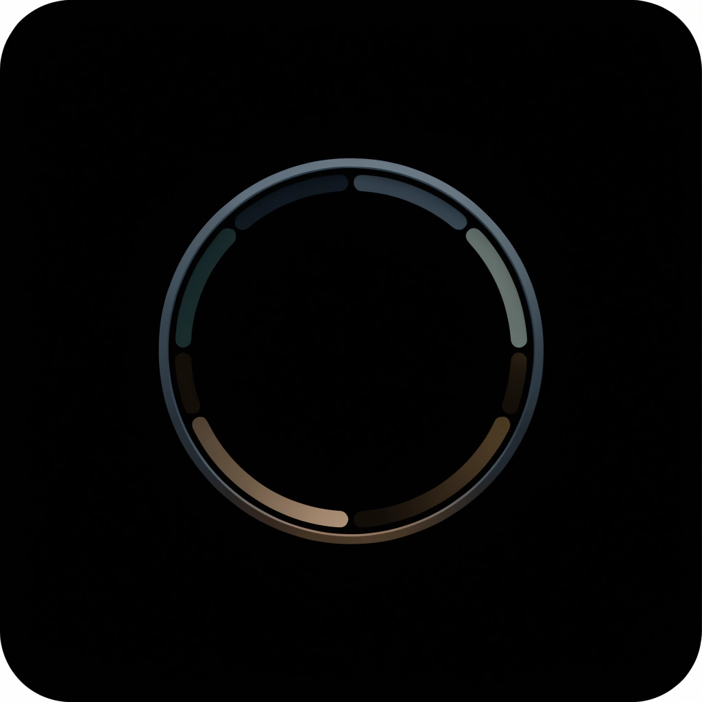

  

# Hermes

Hermes exists to answer a single, fundamental question: what happens to the knowledge we consume? 

Modern software is built around consumption and completion. We are given countless tools to track habits, complete tasks, read articles, and optimize our workflow. We measure success by the number of boxes ticked, the length of the streak, and the sheer volume of data processed. But completion is not understanding. Checking off a task does not mean cognitive growth has occurred. Storing a bookmark does not mean the information has been understood. 

Hermes is not a task manager. It is not a habit tracker. It is not another productivity application designed to make you work faster or optimize your output. 

Hermes is a Personal Development Operating System. It is a quiet, local, and fiercely intentional space designed solely to help you transform information into understanding, and understanding into evolution. It is built to preserve the moments where your mind fundamentally changes.

## Why the Name "Hermes"

The name is not chosen out of an obsession with mythology. Hermes is not an idol to be worshipped; it is a meticulously chosen metaphor. 

In ancient tradition, Hermes was the messenger—the entity capable of traversing different realms, crossing borders that others could not. In this system, Hermes represents the movement of knowledge. Ideas travel. Information crosses boundaries. Understanding requires a bridge between what you knew yesterday and what you realize today. The application exists to serve as that bridge, helping you move raw knowledge across the threshold of mere consumption into genuine, internalized understanding. 

## The Codex

Hermes is governed by a strict philosophical Codex. Every feature must justify its existence against these rules. If a feature violates the Codex, it is rejected. 

Why are there no streaks in Hermes? Because streaks rely on anxiety. Guilt-driven productivity eventually fails because it punishes the user for living a normal human life. Missing a day is not a failure; it is reality. Hermes records reality without judgment. 

Why are there no XP, coins, or achievements? Because gamification manipulates the user into performing actions for digital dopamine rather than genuine curiosity. Growth must be intrinsically motivated. 

Why are there no push notifications, algorithmic feeds, or infinite scrolling? Because modern software optimizes for capturing your attention. Hermes optimizes for intention. An algorithmic feed assumes you do not know what is best for yourself and attempts to decide for you. Infinite scrolling is designed to eliminate the stopping cues that tell your brain it is time to reflect. Hermes possesses no feeds and issues no demands. It waits quietly for you to arrive with intent.

## Intentionality

Intentionality is the bedrock of Hermes. Modern technology has trained us to passively receive information. We doom-scroll, we let algorithms suggest our next video, and we allow apps to automatically sync massive lists of unread content. 

Hermes demands the opposite. Nothing enters Hermes accidentally. Every single piece of knowledge must be manually and deliberately chosen by the user. Why? Because manually choosing knowledge creates stronger psychological ownership. When you actively decide to bring a question, an article, or an idea into your workspace, you are making a conscious commitment to engage with it. You are moving from a passive consumer to an active curator of your own mind.

## The Information Architecture

Knowledge in Hermes naturally flows downward through a strict hierarchy. Flat folders fail because they lack context and inevitably devolve into chaotic digital junk drawers. Hermes enforces structure to preserve meaning:

Workspace 

↓ 

Domain 

↓ 

Block 

↓ 

Item 

↓ 

Reflection 

↓ 

Evolutio

A Workspace separates the major facets of your life. A Domain categorizes long-term pillars within a Workspace. A Block is a specific environment within a Domain. An Item is the raw knowledge inside that Block. A Reflection is your thought upon that Item. And an Evolutio is the final, crystallized realization. Knowledge flows downward until it reaches its highest state of density: changed thinking.

## The Cognitive Equation

The entire architecture of Hermes exists to facilitate and protect a specific cognitive sequence:

**Experience → Reflection → Insight → Evolutio → Evolution**

Experience is what happens to you—the article you read, the mathematical problem you solved, the idea you had. Reflection is the deliberate act of pausing to examine that experience. Insight is the sudden clarity derived from that examination. An Evolutio is the recorded, permanent proof of that insight. Evolution is the compounding result of those moments accumulated over time. 

If software only captures the "Experience" (the task, the bookmark), it fails. Hermes refuses to stop there. It gently pushes the user all the way down the equation.

## Veritas

Veritas is the Latin word for truth. In Hermes, Veritas is the mechanism for recording reality when life interrupts your pursuits.

Why does Veritas exist? Because traditional habit trackers lie. If you study for 100 days, miss one day because you are sick, and the tracker resets your streak to zero, the software is lying about your progress. It is using guilt to drive engagement. 

Veritas exists to replace guilt with objective truth. When you miss a day in Hermes, you do not lose points. You simply record a Veritas—a short, honest explanation of why you paused. Perhaps you were exhausted. Perhaps you were prioritizing your family. Perhaps you simply needed rest. 

Recording reality is infinitely healthier than pretending you possess machine-like consistency. Even if a user never writes another Evolutio, Veritas exists to ensure that truth itself is preserved. We chose the name Veritas rather than "Journal", "Diary", or "Daily Log" because those words imply emotional venting. Veritas implies the clinical, objective documentation of reality. 

## Evolutio

An Evolutio is a documented cognitive shift. It is the atomic unit of growth in Hermes.

Why is the word intentionally singular? Because an Evolutio is a distinct, standalone realization. Why does not every reflection become an Evolutio? Because genuine understanding cannot be forced. You can read ten articles and write ten reflections, but you might only experience one true cognitive shift. Cognitive shifts are rare, and Hermes treats them with the reverence they deserve. 

Hermes measures your progress by counting your Evolutios, rather than your completed tasks, because changed thinking is the only metric that actually matters in personal development. The Latin word Evolutio was chosen because it translates to "an unrolling" or "an unfolding"—the exact sensation of a complex idea finally making sense in your mind.

## The Interface as a Philosophical Decision

Every screen in Hermes is a philosophical decision. Nothing is designed merely for aesthetics.

### Today's Pursuit
Why does Today's Pursuit only show a few items instead of a backlog of 100 tasks? Because progress happens through focused attention, not overwhelming choice. Presenting a user with 100 tasks creates anxiety and decision fatigue. Presenting them with three intentional goals creates focus and calm. 

### Pinned Domains
Why do we pin Domains? Because human beings repeatedly return to the same core areas of knowledge. Reducing friction is critical; if accessing your most important knowledge takes too many clicks, you will stop doing it.

### Recent Evolutios
Why should changed thinking remain visible on the home screen? Because we easily forget how much we have grown. Seeing your recent Evolutios serves as a constant, quiet reminder that your efforts are actually resulting in tangible internal change.

### Evolution
Why visualize growth with a heatmap? Because humans are visual creatures who need to see the weight of their consistency. But why combine Veritas with Evolutios on the timeline? Because a completely full heatmap of blind activity is meaningless. By placing your moments of growth (Evolutio) side-by-side with your honest pauses (Veritas), the timeline visualizes your actual human journey, not a robotic streak.

### Workspaces
Why separate lives into Workspaces? Why not one giant database? Because context switching is expensive. When you are studying pure mathematics, you should not be looking at your grocery list or your startup ideas. Workspaces create hermetically sealed environments for different identities. 

## The Anatomy of an Item

Knowledge in Hermes is heavily categorized to enforce intent.

### Questions
Why do Questions exist as a primary item type? Because solving a question creates understanding. When you hold a question in your mind, you create a void that your brain actively seeks to fill.

### Articles and The Reader Engine
Why does Hermes include a custom, local Reader Engine? Because reading should feel intentional. Reading on the modern web is a hostile experience filled with advertisements, pop-ups, and notifications. Hermes renders articles locally to strip away distractions. It treats Markdown and LaTeX as first-class citizens. Reading an article inside Hermes should always feel profoundly better than reading it on its original website.

### Notes
Why does Hermes strictly use plain text Markdown for Notes? Because proprietary formats eventually die. Software companies go bankrupt. File formats become unsupported. Plain text lasts forever. By forcing notes into standard Markdown, Hermes ensures that your knowledge will remain readable and accessible decades from now, long after Hermes itself is gone.

### Ideas
Ideas deserve their own space because they are fragile. They are not notes; they are hypotheses waiting to be tested.

### Observations
Small observations are the seeds of future insights. Logging them separately ensures they do not get lost in the noise of daily tasks.

### Reflections
Thinking completes learning. Reading a book without reflecting on it is entertainment, not education. Hermes intentionally forces you to pause and reflect on Items to close the cognitive loop.

## The Knowledge Pipeline

Hermes strictly regulates how knowledge enters the system via Manual Import, RSS, and curated Community Sources.

Why are there no automatic AI recommendations? Because an AI suggesting what you should learn next violates the law of intentionality. The user must actively pull knowledge into their system. Hermes provides the pipes (RSS, Community) but the user must turn the valve.

## Search

Why does Search operate primarily on ideas and content rather than just filenames and folders? Because human memory is associative. You rarely remember exactly which folder you placed a concept in, but you always remember the core idea. By storing everything locally and indexing the raw content, Hermes ensures that everything is instantly discoverable.

## Archive

Why does Hermes archive items instead of immediately deleting them? Because knowledge is rarely useless; it is usually just out of context. 

Hermes employs a self-healing archive philosophy through Felix. When you dismiss an item, you are not destroying it; you are telling the system you do not need it right now. Felix ensures that if you ever need that knowledge again, it can be recovered exactly as it was, with all metadata intact. 

## The Starter Workspace

Why does Hermes ship with a fully populated Starter Workspace? Because a blank screen is intimidating. 

The Starter Workspace demonstrates every Item type, Domain, and Block in action. But more importantly, it is designed to inspire rather than just teach. It contains genuine, thought-provoking philosophical concepts rather than generic "Test Note 1" placeholders. It proves to the user what a mature, carefully curated workspace looks like, encouraging them to create their own.

## Offline First

Hermes does not just "work offline." Offline is its default state. 

Why? Because of ownership and longevity. Personal knowledge is the most intimate data a human being can possess. It should never depend on a company's servers remaining online. It should never be held hostage by a subscription fee. By utilizing local SQLite databases and plain Markdown, Hermes ensures that you physically own your thinking. 

## .hermes Bundles

Knowledge deserves portability. Users own their own thinking, which means knowledge must be transferable without lock-in.

Hermes introduced the `.hermes` bundle—a compressed, standardized package of your knowledge. This allows for selective importing and merging of knowledge between different users or devices. You can export a single mathematical Block, share it with a colleague, and they can import it flawlessly into their own workspace. It guarantees long-term preservation because the `.hermes` format is entirely open and readable by standard unzipping tools.

## Naming Decisions

Every name in Hermes was chosen carefully. Simpler alternatives were rejected because they lacked philosophical weight.

- **Hermes**: Not "Notes App". Because it is about the movement and translation of knowledge.
- **Veritas**: Not "Journal". Because it is about objective, unapologetic truth.
- **Evolutio**: Not "Milestone". Because it represents the unfolding of a new mental model.
- **Felix**: Not "Trash". Felix means "lucky" or "happy" in Latin, reframing the archive as a serendipitous safety net rather than a garbage bin.
- **Domains**: Not "Folders". Because they represent vast, lifelong territories of mastery.
- **Blocks**: Not "Sub-folders". Because they are solid, foundational building blocks of a specific subject.
- **Today's Pursuit**: Not "To-Do List". Because you are pursuing understanding, not just doing tasks.
- **Genesis, Ascension, Constellation**: The release roadmap names. Not v1, v2, v3. Because the software itself is evolving from foundational creation (Genesis), to rising capability (Ascension), to interconnected knowledge sharing (Constellation).

## The Design Philosophy

Hermes is dark by default. It utilizes OLED blacks, soft typography, and generous whitespace. 

Why are there no bright colors? Why is the typography so soft? Because reading should feel calm. Bright colors alarm the nervous system and demand attention. OLED black recedes into the background. The ultimate goal of the Hermes design language is for the interface to completely disappear, leaving nothing between you and the knowledge you are consuming.

## The Long-Term Vision

Hermes is not a project designed for next semester. It is a decades-long vision. 

The architecture values longevity over modern development trends. We chose SQLite, plain text, and Markdown because those formats will outlive us. Future contributors to this codebase must preserve these principles. Features may be added, interfaces may be refined, but the core philosophy must remain untouched. 

We are building an enduring sanctuary for human thought.

## 

Hermes exists because information is abundant, but genuine understanding is rare. 

The purpose of Hermes is not to store knowledge. 
The purpose of Hermes is to preserve the moments in which knowledge changes the person who possesses it.
