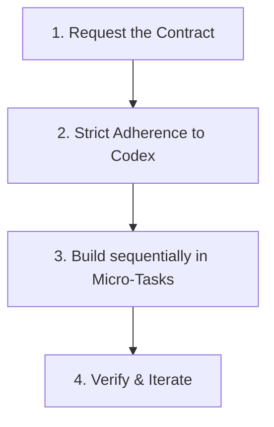

# 🤖 Hermes AI Implementation Rules

> **Status:** Active & Enforced  
> **Target:** AI Coding Assistant (Antigravity)

---

> [!IMPORTANT]
> **CRITICAL DIRECTIVE**  
> Your job is **NOT** to design Hermes. Your job is to **faithfully implement** Hermes. If a design decision is not explicitly specified in the Codex, **STOP** and ask for clarification instead of inventing one.
>
> * You are strictly forbidden from making ad-hoc design decisions.
> * Never fill gaps with assumptions.
> * Implement exactly what is written.
> * The system architecture is frozen.

---

## 🔄 The Workflow Protocol

Do **NOT** attempt to build entire screens at once. You must strictly adhere to the Component-by-Component protocol.

### Implementation Process

1. **Request the Contract:** Before writing any code, ask the user for the "Screen Contract" or "Component Contract".
2. **Strict Adherence:** Read **ONLY** the relevant sections of the Codex provided by the user. Ignore everything else to conserve context window.
3. **Micro-Tasks:** Build sequentially. (e.g., *Build Header* ➔ *Verify*. *Build Question Card* ➔ *Verify*).

---

## 📐 Strict Measurable Constraints

Abstract words like *"minimal"* or *"clean"* are banned. Use these hard, testable constraints instead:

| Constraint | Limit / Rule | Details |
| :--- | :--- | :--- |
| **Section Limit** | Max 5 major sections | Keep screens focused and avoid page creep. |
| **Visual Hierarchy** | Max 2 emphasis levels | (e.g., Title and Subtitle only). No complex nested typography. |
| **Card Height** | Max `180px` | No card can exceed this height to prevent visual crowding. |
| **Whitespace** | Intentional separation | Use `HermesSpacing` tokens to group items. Never leave empty dead zones. |
| **Action Limit** | Max 1 Primary Action | (e.g., "Solve", "Create Block") must appear only once per screen. |
| **No Gamification** | Strictly Banned | Zero charts, zero progress bars, zero streaks, zero XP. |

---

## 📄 Example Screen Contract (The Standard)

When implementing, you must adhere to contracts formatted exactly like this:

### **TODAY SCREEN CONTRACT**
* **Purpose:** Guide today's intentional growth.

#### **Composition Rules**
* **Must Contain:**
  * [x] Greeting
  * [x] Today's Question
  * [x] Pinned Blocks
  * [x] Recent Evolutios
  * [x] Veritas (Truth log entry form)
* **Must NOT Contain:**
  * [ ] Analytics / Data usage charts
  * [ ] Large hero cards
  * [ ] Streaks or daily counters
  * [ ] Progress bars

#### **Visual Constraints**
* Question card: Maximum `160px` height.
* Pinned blocks: Must be displayed in compact chips.
* Evolutios: Rendered strictly as a vertical timeline.
* Veritas: Only visible when active/applicable.

#### **Success Criteria**
> The user must know exactly what to do within **3 seconds** of opening the screen.
