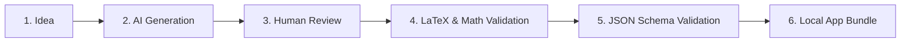
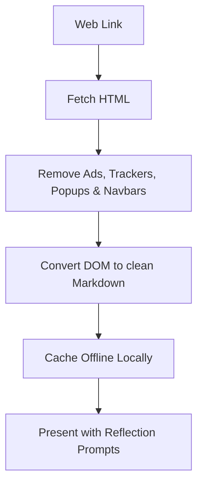

# 🗂️ Hermes Data Pipelines & Content Architecture

This document outlines how content flows, validates, and models itself inside the Hermes system. It details our schemas, scraping pipelines, and the strict rules governing what enters the user's focus space.

---

## 🏛️ Content Philosophy (Chapter 1)

Every piece of content in Hermes must have a clear purpose. We prioritize quality over quantity.

*   **Quality > Quantity:** Fewer items, higher depth.
*   **Teach Principles:** Encourage active understanding and first-principles thinking, not rote memorization of isolated facts.
*   **Curiosity First:** Every question must create curiosity.
*   **Reflection Required:** Every article must invite reflection.

---

## 🎛️ The Question Pipeline (Chapter 2)

Questions do not live in databases outside the client; they are bundled directly into the application in JSON format.



### JSON Schema Specification
Every question is formatted as a structured object:

```json
{
  "id": "prob_001",
  "difficulty": "medium",
  "topic": "Expected Value",
  "question": "Suppose you play a game where...",
  "latex": "\\mathbb{E}[X] = \\sum x P(X=x)",
  "answer": "1.5",
  "hint": "Think about the probabilities of each state.",
  "explanation": "To calculate the expected value...",
  "reflectionPrompt": "How does this change your intuition about risk?",
  "tags": ["Probability", "Expected Value", "Risk"]
}
```

---

## 📰 The Article Pipeline (Chapter 3)

Hermes processes web articles by stripping out their design and keeping only their pure knowledge.



**Rule:** Hermes never stores the website's layout or style sheet. It only caches the structured knowledge.

---

## 🏁 Starter Content (Chapter 4)

Hermes must never open to a blank screen. The application ships with starter blocks containing:
1.  **Sample Questions:** Explaining problem-solving states.
2.  **Sample Reflections:** Introducing the journal workflow.
3.  **Sample Evolutios:** Illustrating what cognitive growth looks like.
4.  **Sample Articles:** Showcasing the offline reader.

---

## 📐 Content Standards (Chapter 5)

| Item Type | Standards |
| :--- | :--- |
| **Questions** | Must be Correct, Timeless, Clear, Practical, and Thought-provoking. |
| **Articles** | Must be Readable, Minimal, Distraction-free, and Offline-compatible. |

---

## 📝 Item Templates (Chapter 6)

Consistent schemas define all core items:

### 1. Question Template
*   **Title**
*   **Difficulty**
*   **Question Body**
*   **Hint**
*   **Solution/Answer**
*   **Reflection Prompt**

### 2. Article Template
*   **Title**
*   **Author / Publication**
*   **Source URL**
*   **Reading Time**
*   **Content Body (Markdown)**
*   **Reflection Prompt**

### 3. Quote Template
*   **Quote Text**
*   **Author**
*   **Meaning / Context**
*   **Reflection Prompt**

### 4. Observation Template
*   **Title**
*   **Observation Text**
*   **Reflection / Action Items**
*   **Tags**

---

## 🤖 AI Content Generation Rules (Chapter 7)

Hermes never blindly trusts AI-generated content. All AI outputs must follow this verification protocol:

```text
[AI Generator] ➔ [Automated Validation] ➔ [Human Review & Sign-Off] ➔ [Hermes Bundle]
```

*   **Rule:** AI helps create initial ideas, but a human must approve every question before it enters the ecosystem.

---

## 📌 Versioning & Portability (Chapters 8 & 9)

Every exported content package (`.hermes`) stores metadata to ensure it remains compatible across clients:

*   **Content Version**
*   **Date Created / Updated**
*   **Compatible Hermes Client Version**

### Community Packages
Users can share learning packages (e.g., `Stoicism.hermes`, `DSA.hermes`, `Python.hermes`). All community packages must:
*   Follow Hermes content standards.
*   Include clear metadata, description, license, and version number.

---

## 🔮 Future Expansion & Modular Design (Chapter 10)

> **Architectural Law:** Content must be modular. The application should never care whether an Item is a Question, Article, Quote, or something invented years later (e.g., Research Papers, Case Studies, Projects, Code Snippets). 

By building the data pipeline around general interface contracts rather than strict type-specific logic, the pipeline remains identical even as the ecosystem grows.
