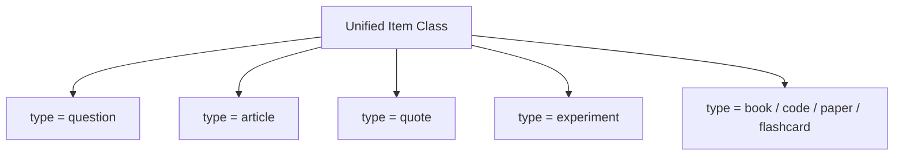

# ⚙️ Hermes Engine Architecture

This document defines the platform-level architecture of Hermes. Rather than a collection of hardcoded screens and database tables, Hermes is built as a set of modular, reusable **Engines** to guarantee that the platform can scale gracefully for decades.

---

## 🏛️ The Modular Architecture

Hermes is structured as a collection of core engines:

```text
Hermes OS
├── 📖 Reader Engine
├── 🎛️ Question Engine
├── ✍️ Reflection Engine
├── 🌱 Evolutio Engine
├── 🔍 Search Engine
├── 📦 Backup/Export Engine
├── 📥 Import Engine
└── 🗃️ Archive Engine
```

This modular structure mimics extensible systems like Obsidian. Instead of inventing custom ad-hoc behaviors for every new feature, we build reusable engines that future elements plug into.

---

## 📖 1. Reader Engine

The Reader Engine separates the **Source** of knowledge from its **Presentation**. 

```text
[Internet / Web Link] 
         ↓
   [Fetch Article]
         ↓
  [Extract Content] (Strips layout, ads, paywalls)
         ↓
[Convert to Markdown] (Done via html2md)
         ↓
 [Hermes Typography] (Rendered in consistent styling)
```

### Presentation Rule:
Regardless of whether an article is fetched from Medium, Dev.to, Hacker News, Reddit, or a personal blog, the presentation is always rendered in the unified **Hermes Reader** using native OLED-dark themes and consistent spacing rules.

### Offline Caching:
Articles are cached locally on first fetch. Subsequent opens are completely offline and load instantly.

---

## 🎛️ 2. Question Engine

The Question Engine processes LaTeX formulas, markdown text, hints, solutions, and reflection prompts identically.

```text
[Plain Text / MD] ➔ [LaTeX Parser] ➔ [Interactive Hints] ➔ [Solution Reveal] ➔ [Reflection Prompt]
```

### Formulas and Equations
To support topics like Linear Algebra, Calculus, Statistics, and AI, formulas are never stored as static images. Instead, they are stored as **LaTeX** (e.g. `P(A|B)=\frac{P(B|A)P(A)}{P(B)}`) and compiled/rendered locally in real-time.

---

## 🧬 3. Item Scalability & Type System

To prevent future code rewrites, the database schema avoids hardcoding separate models for every new category. Instead, we define a unified `Item` contract that uses a `type` parameter:



By ensuring all data pipelines and rendering components interact with a generic `Item` interface, we can add new types of knowledge elements five years from now without modifying the underlying database.
