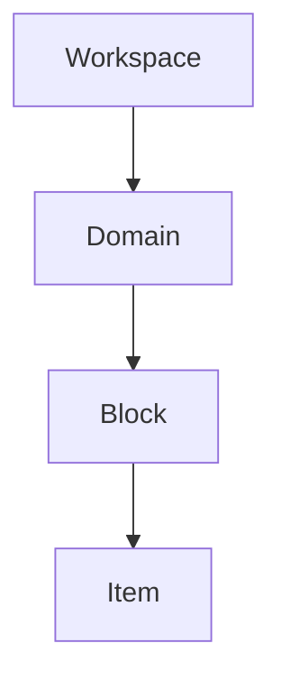

# 🏛️ Hermes Information Architecture

Hermes does not borrow generic screen patterns (like dashboard analytics or arbitrary calendars) simply because other applications have them. Every screen must justify its existence. 

This document defines the storage boundaries, the pipeline workflows, and the capabilities of every object in the system.

---

## 🗂️ Storage Hierarchy vs. Philosophy Pipeline

We separate **where things live (Storage)** from **what happens (Philosophy)**.

### 1. Storage Hierarchy
A nested, multi-level map of containers to keep cognitive areas separate and prevent clutter.



*   **Workspace:** Isolates entire life context environments (e.g. *Harsha* vs. *Work*).
*   **Domain:** High-level areas of growth (e.g., *Engineering*, *Thinking*, *Life*).
*   **Block:** Specific learning environments (e.g., *Mathematics*, *Psychology*).
*   **Item:** Individual points of focus (e.g., *Expected Value Question*, *Reading article*).

### 2. Philosophy Pipeline
The workflow where experience is compiled into personal evolution. Reflections do not "live" under items; they are generated *from* items.

$$\text{Experience} \rightarrow \text{Item} \rightarrow \text{Thinking} \rightarrow \text{Reflection} \rightarrow \text{Insight} \rightarrow \text{Evolutio} \rightarrow \text{Evolution}$$

---

## ⚖️ Object Capability Matrix

This matrix prevents design confusion by establishing what actions can be executed on each system element:

| Object | Rename | Reorder | Archive | Delete | Duplicate | Export | Pin / Color |
| :--- | :---: | :---: | :---: | :---: | :---: | :---: | :---: |
| **Workspace** | ✓ | ✗ | ✗ | ✗ | ✓ | ✓ | ✗ |
| **Domain** | ✓ | ✓ | ✓ | ✓ | ✗ | ✗ | ✓ (Color/Icon) |
| **Block** | ✓ | ✓ | ✗ | ✓ | ✓ | ✓ | ✓ (Pin) |
| **Item** | ✓ (Edit) | ✓ (Move) | ✓ | ✓ | ✓ | ✗ | ✓ (Search/Share) |

---

## 🏠 Screen & Feature Justification

### 1. Today Screen
Guide today's intentional growth in under 3 seconds.
*   **Must Contain:** Greeting, Today's Question, Pinned Blocks, Recent Evolutios, and Veritas.
*   **No Clutter:** Avoids large hero cards, progress trackers, or status grids.

### 2. Blocks Screen (Home)
We replace giant cards with a categories directory layout, similar to Spotify's categories.
*   **Starter Blocks:** Shipped on onboarding (e.g. *📘 Mathematics*, *🚀 Startups*, *🧠 Psychology*) containing sample questions/articles. Users are invited to customize or delete them.

### 3. Growth Map
Instead of a flat directory list of blocks, domains compile blocks into a structured tree:
```text
Engineering
├── Mathematics
├── Python
└── AI
Thinking
├── Psychology
└── Philosophy
```

### 4. Unified Raycast-style Search
One search bar to query all entities globally:
```text
[probability]
 ├── Questions: "How should I divide betting money..."
 ├── Articles: "Probability vs Luck"
 ├── Reflections: "Today I finally understood..."
 ├── Evolutios: "Expected value changed how I..."
 └── Blocks: "Math"
```

### 5. Evolution Calendar
Hermes includes a calendar, but it is not an event scheduler. It is an **Evolution Calendar** documenting past *Evolutios* and *Veritas* entries, providing an honest diary of when and why you grew.

---

## 📈 Growth Tasks Only

Hermes does **not** handle daily lifestyle checklists. It only supports **Growth Tasks**:

*   **Growth Tasks (Allowed):** *Study PyTorch*, *Read startup article*, *Solve today's probability question*.
*   **Life Tasks (Banned):** *Buy onions*, *Pay electricity bills*, *Attend office meeting*.

*Rule: Hermes keeps you focused on who you want to become, not on reminding you to do chores.*
